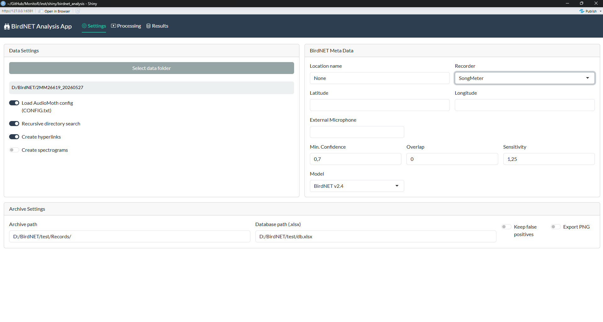
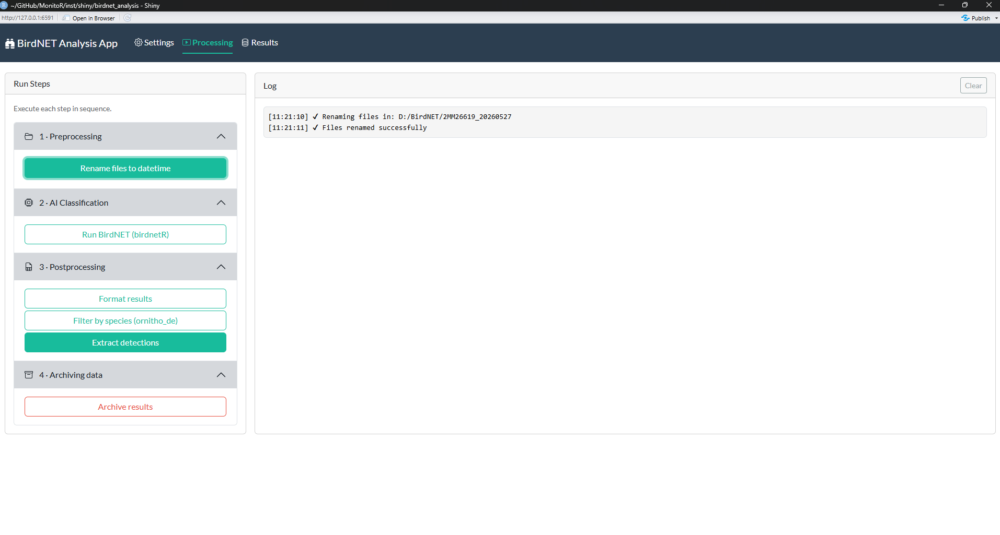
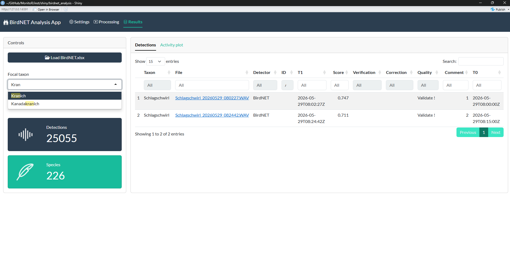

## `MonitoR` package

*Under development*

------------------------------------------------------------------------

This package provides workflows in form of `R Markdown` templates for
processing monitoring data, for now mostly focusing on the analysis of
audio files obtained by deploying passive acoustic monitoring (PAM)
devices. The package partly relies on
[NocMigR2](github.com/mottensmann/NocMigR2). See details there.

To install the package, use
[devtools](https://github.com/r-lib/devtools):

``` r
pak::pak("mottensmann/MonitoR", dependencies = TRUE)
```

Load the package once installed:

``` r
library(MonitoR)
```

## `Shiny-App`

Toggling the entire processing pipeline (formatting, classificiation,
inspecting results) using a shiny app. The classification is performed
using [birdnetR](github.com/birdnet-team/birdnetR):

``` r
birdnet_app()
```



## `RMarkdown Templates`

`MonitoR` provides RMarkdown templates to set-up post-processing and
validation of audio data classified using
[BirdNET-Analyzer](https://github.com/kahst/BirdNET-Analyzer). Using
`RStudio` these are accessible via `File -> New File -> RMarkdown`

### `birdnet`

- 1)  Preprocessing of audio data (renaming to datetime, removing
      unessary file prefixes)
- 2)  Extracting results obtained by using a AI-based classifier with
      [BirdNET-Analyzer](https://github.com/kahst/BirdNET-Analyzer)
- 3)  Archiving manually verified records to a xlsx-database

### `nestcamera`

- 1)  Preprocessing of photos (renaming to datetime and resorting)
